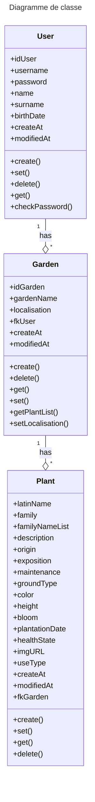

```mermaid
---
title: Diagramme de classe
---
classDiagram
    User "1"--o"*" Garden : has
    Garden "1"--o"*" Plant : has
    class User {
        +idUser
        +username
        +password
        +name
        +surname
        +birthDate
        +createAt
        +modifiedAt
        +create()
        +set()
        +delete()
        +get()
        +checkPassword()
    }
    class Garden {
        +idGarden
        +gardenName
        +localisation
        +fkUser
        +createAt
        +modifiedAt
        +create()
        +delete()
        +get()
        +set()
        +getPlantList()
        +setLocalisation()
    }
    class Plant {
        +latinName
        +family
        +familyNameList
        +description
        +origin
        +exposition
        +maintenance
        +groundType
        +color
        +height
        +bloom
        +plantationDate
        +healthState
        +imgURL
        +useType
        +createAt
        +modifiedAt
        +fkGarden
        +create()
        +set()
        +get()
        +delete()
    }
```